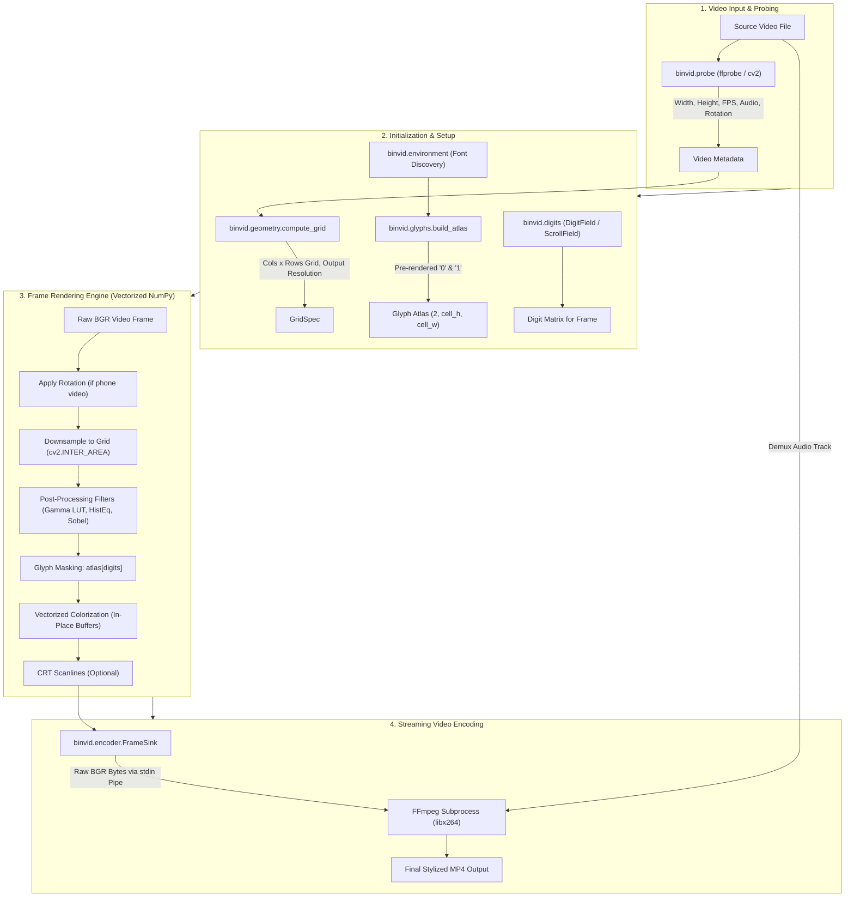

# binvid — Project Architecture & Technical Specification

`binvid` is a high-performance Python video processing engine and interactive web application that transforms standard video footage into binary ASCII art composed of dynamic `0` and `1` glyphs matching the scene's color and luminance.

---

## 1. Executive Summary

- **Primary Purpose**: Convert any video file (`.mp4`, `.mov`, `.mkv`, `.avi`, `.webm`) into stylized binary ASCII animations at real-time speeds (>30 FPS at 1080p).
- **Core Technology Stack**:
  - **Python 3.10+**: Core engine logic and orchestration.
  - **OpenCV (`cv2`)**: Video decoding, SIMD-accelerated resizing, colorspace conversions, and image filtering.
  - **NumPy**: Vectorized glyph masking, in-place memory buffer arithmetic, and color compositing.
  - **Pillow (`PIL`)**: Initial font rasterization and glyph atlas building.
  - **FFmpeg**: Video decoding fallback, audio stream demuxing, and H.264/AAC pipe encoding.
  - **Gradio 6**: Dark glassmorphic interactive web dashboard with real-time frame preview.

---

## 2. System Architecture & Dataflow

The diagram below illustrates the complete end-to-end pipeline from source video ingestion to final encoded output:



---

## 3. Module Breakdown

The `binvid` package is organized into modular components with clear separation of concerns:

| Module | File | Core Responsibilities |
|---|---|---|
| **`app`** | [`binvid/app.py`](binvid/app.py) | Gradio 6 web interface, live preview frame caching, client CSS theming, and job dispatch. |
| **`cli`** | [`binvid/cli.py`](binvid/cli.py) | Command-line argument parsing, environment verification, terminal progress bars, and exit handling. |
| **`config`** | [`binvid/config.py`](binvid/config.py) | Strict dataclass configuration (`RenderConfig`), parameter normalization, and hex/RGB color parsing. |
| **`digits`** | [`binvid/digits.py`](binvid/digits.py) | Random matrix generation: `DigitField` (static, periodic, or partial flips) and `ScrollField` (Matrix rain drift). |
| **`encoder`** | [`binvid/encoder.py`](binvid/encoder.py) | `FrameSink` context manager streaming raw frames into FFmpeg stdin with audio preservation and pipe deadlock prevention. |
| **`environment`**| [`binvid/environment.py`](binvid/environment.py) | Cross-platform font detection (Consolas, Menlo, DejaVu Sans Mono) and FFmpeg binary locator. |
| **`geometry`** | [`binvid/geometry.py`](binvid/geometry.py) | Aspect-ratio correction for non-square font glyphs and calculation of even output dimensions for H.264 YUV420p. |
| **`glyphs`** | [`binvid/glyphs.py`](binvid/glyphs.py) | Rasterizes TrueType font characters `'0'` and `'1'` into an optimized `(2, cell_h, cell_w)` NumPy uint8 array. |
| **`pipeline`** | [`binvid/pipeline.py`](binvid/pipeline.py) | Orchestrates single-process or multiprocessing worker pools (`multiprocessing.Pool.imap`) with progress tracking. |
| **`probe`** | [`binvid/probe.py`](binvid/probe.py) | Video metadata extraction, rotation tag detection (phone videos), audio presence verification, and memory-safe frame generator. |
| **`render`** | [`binvid/render.py`](binvid/render.py) | Core per-frame compositing engine supporting `"color"`, `"mono"`, and `"flat"` modes with post-processing filters. |

---

## 4. How the Rendering Engine Works

### Step 1: Geometry & Aspect Ratio Correction
Monospace font characters are typically taller than they are wide (e.g. 8px wide × 14px high, aspect ratio ~1:1.75). If video pixels were mapped 1:1 to characters, the output video would appear vertically squashed. `compute_grid` calculates the number of rows needed to maintain the original video aspect ratio:

$$\text{rows} = \text{round}\left(\text{cols} \times \frac{\text{src\_h}}{\text{src\_w}} \times \frac{\text{cell\_w}}{\text{cell\_h}}\right)$$

The final video resolution is guaranteed to have even dimensions for H.264 compliance:
$$\text{out\_w} = \text{cols} \times \text{cell\_w}, \quad \text{out\_h} = \text{rows} \times \text{cell\_h}$$

### Step 2: Glyph Atlas Pre-rendering
Instead of drawing text glyphs onto every frame (which is computationally expensive), `build_atlas` pre-renders `'0'` and `'1'` into a NumPy array of shape `(2, cell_h, cell_w)` once at startup:
- `atlas[0]` represents character `'0'`.
- `atlas[1]` represents character `'1'`.
Pixel values range from $0$ (transparent background) to $255$ (opaque glyph ink).

### Step 3: Digit Pattern Animation
Each character cell is assigned a digit (`0` or `1`):
- **Static**: Deterministic random seed, fixed throughout video duration.
- **Refresh**: Every $N$ frames, all cells (or a partial percentage) regenerate new digits.
- **Scroll**: Each vertical column drifts downward at an independent velocity, creating a Matrix-rain effect.

### Step 4: Vectorized Compositing
1. The video frame is downsampled to `(rows, cols)` using OpenCV area-averaging (`cv2.INTER_AREA`).
2. The digit matrix selects the glyphs: `atlas[digits]` produces an array of shape `(rows, cols, cell_h, cell_w)`.
3. NumPy restriding/reshaping converts this into a full-resolution 2D mask matching `(out_h, out_w)`.
4. The downsampled video colors/luminance are scaled up to full resolution using `cv2.resize(..., interpolation=cv2.INTER_NEAREST)`.
5. Pre-allocated in-place memory buffers multiply the color canvas by the normalized glyph mask in $11\text{ ms}$, avoiding heap reallocations.

---

## 5. Web Application Architecture

The web interface is built with **Gradio 6** using custom CSS and glassmorphic aesthetic guidelines:

- **Launch Script**: [`run_app.py`](run_app.py) boots the dashboard.
- **Sub-15ms Live Preview**:
  - When a video is uploaded, a frame at 25% of the duration is extracted and cached in `_PREVIEW_FRAME_CACHE`.
  - Adjusting any slider (columns, font size, gamma, refresh rate) or selecting modes/colors re-renders the cached frame instantly in memory without writing to disk.
- **Centered Responsive Design**:
  - Custom CSS centers the primary container card horizontally on all displays.
  - Symmetrical dual-column layout: Source Video & Settings on the left, Live Preview & Rendered Output on the right.
- **Opaque High-Contrast Dropdowns**:
  - Styled with `#07190e` solid background and bright green highlight on hover/selection to eliminate background bleed-through.
- **Accurate Numeric Alignment**:
  - Slider numeric text inputs are centered vertically and horizontally within 32px containers without displacement or sunken glyphs.
- **Automatic Cleanup**:
  - Output videos are saved in a temporary directory with background pruning of files older than 1 hour or exceeding 20 items.

---

## 6. How to Start the Project

### Prerequisites
1. **Python 3.10+**: Ensure Python is available on your system.
2. **FFmpeg**: Required for audio remuxing and video encoding:
   - **Windows**: `winget install Gyan.FFmpeg` or `choco install ffmpeg`
   - **macOS**: `brew install ffmpeg`
   - **Linux**: `sudo apt install ffmpeg`

### Quick Start Commands

#### 1. Setup Environment
```bash
# Clone or open the repository folder
cd /path/to/Binary-Video

# Create and activate a virtual environment
python -m venv venv

# Windows activate:
.\venv\Scripts\activate

# Linux/macOS activate:
source venv/bin/activate

# Install required dependencies
pip install -r requirements.txt
pip install -e .
```

#### 2. Start the Web App
```bash
python run_app.py
```
Open your browser at **`http://127.0.0.1:7860`** (or the port indicated in the terminal).

To customize the host, port, or create a shareable link:
```bash
python run_app.py --host 0.0.0.0 --port 8080 --share
```

#### 3. Run via CLI
```bash
# Basic color conversion:
binvid input.mp4

# Matrix monochrome rain with CRT scanlines:
binvid input.mp4 -o matrix.mp4 --mode mono --digit-mode scroll --scanlines --cols 220

# High-contrast silhouette look:
binvid input.mp4 -o silhouette.mp4 --mode flat --contrast-boost --crf 16
```

#### 4. Run Tests
```bash
python -m unittest discover tests
```
