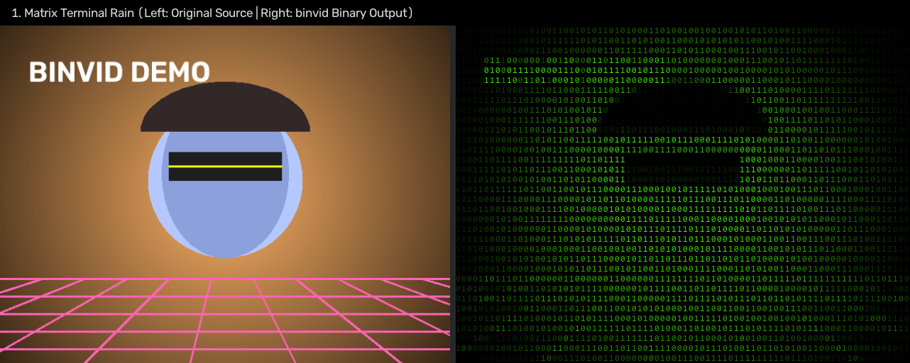
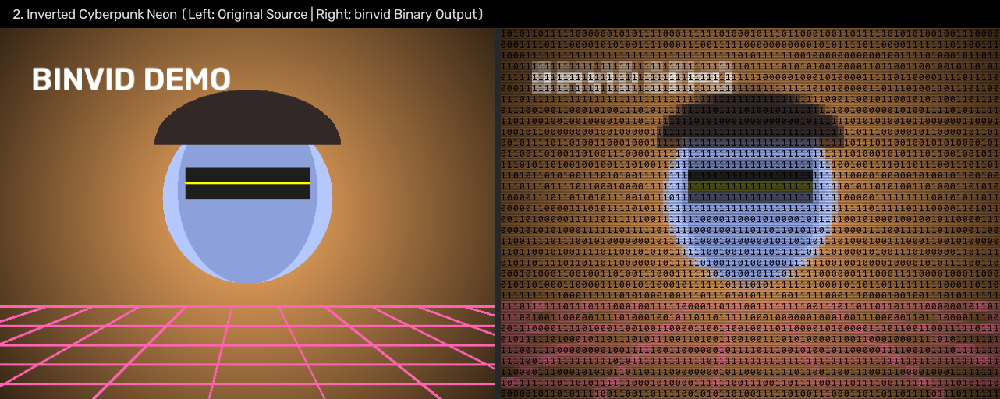
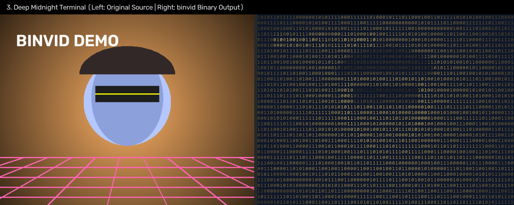
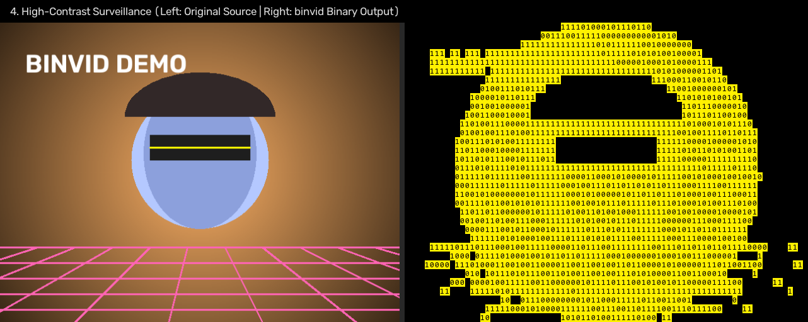
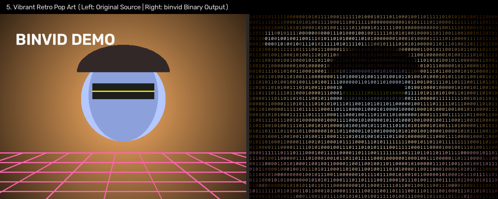

# binvid — Binary ASCII Video Art

**binvid** is a high-performance Python video processing engine and interactive web application that transforms standard videos into stylized, binary ASCII animations composed of dynamic `0` and `1` digits matching scene colors and luminance.

---

## Quickstart: How to Start It

Get up and running in less than 2 minutes.

### 1. Prerequisites
- **Python**: Version 3.10 or higher.
- **FFmpeg**: Required for audio remuxing and video streaming.
  - **Windows**: `winget install Gyan.FFmpeg` or `choco install ffmpeg`
  - **macOS**: `brew install ffmpeg`
  - **Linux**: `sudo apt install ffmpeg`

### 2. Setup Environment & Install
```bash
# 1. Open the project directory
cd /path/to/Binary-Video

# 2. Create and activate a virtual environment
python -m venv venv

# On Windows:
.\venv\Scripts\activate
# On macOS/Linux:
source venv/bin/activate

# 3. Install dependencies
pip install -r requirements.txt

# 4. Install binvid package in editable mode
pip install -e .
```

### 3. Launch the Web App
Run the launcher script:
```bash
python run_app.py
```
Open your browser at **`http://127.0.0.1:7860`**.

> **Options**:
> - Specify port: `python run_app.py --port 8080`
> - Bind network: `python run_app.py --host 0.0.0.0`
> - Public shareable link: `python run_app.py --share`

### 4. Or Run via Command Line (CLI)
```bash
# Basic conversion (outputs <input>_binary.mp4 in full color)
binvid input.mp4

# Green monochrome Matrix rain:
binvid input.mp4 -o matrix.mp4 --mode mono --digit-mode scroll --scanlines --cols 220

# High-contrast silhouette look:
binvid input.mp4 -o silhouette.mp4 --mode flat --contrast-boost --crf 16
```

---

## How It Works

`binvid` renders binary ASCII art at over **30 FPS for 1080p** by avoiding slow per-character font drawing and instead using a pre-rendered glyph atlas and vectorized NumPy memory operations.

```
[ Input Video ] 
       │
       ▼
1. Metadata & Orientation Probing (ffprobe / cv2)
       │
       ▼
2. Aspect-Ratio Corrected Grid Sizing (cols × rows)
       │
       ▼
3. Pre-rendered Glyph Atlas ('0' & '1' rasterized into numpy array once at startup)
       │
       ▼
4. Dynamic Digit Field (Matrix drift, static, or periodic refresh)
       │
       ▼
5. Vectorized Compositing & Filters (cv2 downsampling + in-place memory buffer multiply)
       │
       ▼
6. Streaming Video Pipe & Audio Remux (FFmpeg libx264 stdin + original audio passthrough)
       │
       ▼
[ Rendered MP4 Output ]
```

### Detailed Pipeline Stages

1. **Orientation & Metadata Probing (`binvid.probe`)**:
   - Extracts resolution, framerate, duration, and audio stream presence.
   - Detects smartphone rotation metadata (`tags.rotate` / `side_data_list.rotation`) so portrait videos are automatically oriented correctly instead of rendering sideways.
2. **Aspect Ratio Geometry (`binvid.geometry`)**:
   - Monospace font characters are taller than they are wide (e.g., 8×14 px, ~1:1.75 ratio).
   - `binvid` computes character row counts so the scene aspect ratio remains true to the original footage, guaranteeing even dimensions for H.264 video compliance.
3. **Glyph Atlas Pre-rendering (`binvid.glyphs`)**:
   - At startup, TrueType font characters `'0'` and `'1'` are rasterized once into an optimized `(2, cell_h, cell_w)` uint8 array.
   - During rendering, zero text rendering calls are made.
4. **Digit Field Animation (`binvid.digits`)**:
   - Assigns a binary digit to each cell across time:
     - **Refresh Mode**: Periodically regenerates digits (or flips a partial percentage) for dynamic digital chatter.
     - **Static Mode**: Consistent pattern fixed across all frames.
     - **Scroll Mode**: Independent columns drifting downward at varying velocities (Matrix-rain effect).
5. **Vectorized Frame Compositing (`binvid.render`)**:
   - Video frames are downsampled to the grid dimensions using OpenCV area averaging (`cv2.INTER_AREA`).
   - The digit array slices into the glyph atlas in a single vectorized NumPy operation (`atlas[digits]`).
   - Pre-allocated in-place memory buffers multiply and tint character cells in $\sim 11\text{ ms}$ per frame without memory thrashing.
   - Optional post-processing filters (gamma LUT, histogram contrast boost, Sobel edge emphasis, CRT scanlines) are applied.
6. **Streaming FFmpeg Encoding (`binvid.encoder`)**:
   - Rendered frames stream directly into an FFmpeg subprocess pipe via stdin.
   - Audio from the original video is demuxed and remuxed into the output file synchronously without re-encoding quality loss.

For in-depth architecture and module specifications, see [PROJECT.md](PROJECT.md).

---

## Interactive Web Interface

The web interface provides an instantaneous live preview and interactive parameter dials in a centered, dark glassmorphic layout.

### Web UI Features

- **Centered Responsive Layout**: Symmetrical, glassmorphic layout centered on any display width.
- **Sub-15ms Live Preview**: Extracts a frame at 25% of the video duration into memory. Changing any slider, dropdown, or toggle updates the preview in real-time before committing to a full video render.
- **High-Contrast Opaque Dropdowns**: Clear, non-transparent dropdowns for Render Mode and Digit Mode with glowing green selection states and zero background bleed-through.
- **Precision Numeric Inputs**: Slider number boxes with centered, legible values and reset controls.
- **Instant Video Download**: The converted video plays in-browser and reveals an instant "Download video" button. Temporary output files are automatically garbage-collected after 1 hour.

---

## Command-Line Interface (`binvid`)

Convert any video with the `binvid` command-line tool (or `python -m binvid.cli`):

```bash
# Basic conversion (defaults to <input-stem>_binary.mp4 in full color)
binvid input.mp4

# Matrix green monochrome mode with drifting Matrix-rain scroll:
binvid input.mp4 --mode mono --digit-mode scroll --cols 220

# High-contrast thresholded flat look with custom output destination:
binvid input.mp4 -o harsh_terminal.mp4 --mode flat --cols 180 --crf 16

# Available Options:
#   input                  Path to source video file
#   -o, --output           Output video path (default: <input>_binary.mp4)
#   --cols                 Grid columns (default: 200)
#   --cell-w               Cell width in pixels (default: 8)
#   --cell-h               Cell height in pixels (default: 14)
#   --font                 Custom TTF font path (default: auto-detect)
#   --font-size            Font size (default: 12)
#   --mode                 Render style: color, mono, flat (default: color)
#   --digit-mode           Pattern strategy: static, refresh, scroll (default: refresh)
#   --refresh              Regenerate every N frames (default: 8)
#   --seed                 Random seed (default: 42)
#   --crf                  H.264 CRF quality [0-51] (default: 18)
#   --workers              Number of worker processes for rendering (default: 1)
#   --limit                Process only the first N frames for fast iteration (default: all)
#   --invert               Invert rendering: dark digits on light/colored background
#   --bg                   Background canvas color hex (#RRGGBB) or RGB (R,G,B) (default: #000000)
#   --gamma                Gamma correction on cell brightness (> 0, e.g. 0.7 for dark footage; default: 1.0)
#   --contrast-boost       Per-frame histogram equalization to preserve mid-tones
#   --scanlines            Darken alternating output rows slightly (CRT style)
#   --edge-emphasis        Sobel edge detection biasing high-gradient cells toward digit '1'
#   --no-progress          Disable tqdm progress bar
```

---

## Environment Verification

Verify that your system has FFmpeg and a monospace font detected by running:

```bash
python -m binvid.environment
```

Sample output:
```text
=== binvid Environment Verification ===
FFmpeg binary : C:\path\to\ffmpeg.exe
Monospace font: C:\WINDOWS\Fonts\consola.ttf
```

---

## Probing Videos (`binvid.probe`)

You can inspect video metadata, detect audio streams, and verify frame counts:

```bash
python -m binvid.probe path/to/video.mp4
```

In Python code:
```python
from binvid import probe, frame_iter

# Retrieve video metadata
info = probe("video.mp4")
print(f"{info.width}x{info.height} @ {info.fps} fps, frames: {info.frame_count}, audio: {info.has_audio}")

# Iterate through frames safely without loading all into memory
for frame in frame_iter("video.mp4"):
    # frame is a BGR np.ndarray
    pass
```

---

## Grid & Geometry Calculations (`binvid.geometry`)

Calculate output character dimensions correcting for non-square font aspect ratios and guaranteeing even pixel dimensions for H.264 / YUV420p video encoding:

```python
from binvid import compute_grid, fit_cols_to_width

# Compute character grid and pixel dimensions
spec = compute_grid(
    src_w=1920,
    src_h=1080,
    cols=200,
    cell_w=8,
    cell_h=14,
)
print(f"Grid: {spec.cols}x{spec.rows} characters -> Output: {spec.out_w}x{spec.out_h} pixels")
# out_w and out_h are guaranteed to be even numbers without letterbox padding

# Solve for column count matching a desired output width (e.g. roughly 1080p)
cols = fit_cols_to_width(src_w=1920, src_h=1080, target_out_w=1920, cell_w=8, cell_h=14)
```

---

## Glyph Atlas Pre-rendering (`binvid.glyphs`)

Pre-render centered binary glyphs ("0" and "1") into a high-performance numpy array once at startup to avoid per-frame drawing overhead:

```python
from binvid import build_atlas, preview_atlas

# Pre-render glyph atlas of shape (2, cell_h, cell_w)
atlas = build_atlas(
    font_path="C:/Windows/Fonts/consola.ttf",
    font_size=12,
    cell_w=8,
    cell_h=14,
)
# atlas[0] is '0', atlas[1] is '1' (uint8 array, 0-255)

# Save nearest-neighbor upscaled preview image
preview_atlas(atlas, scale=8, output_path="atlas_preview.png")
```

Verify glyph centering via CLI:
```bash
python -m binvid.glyphs
```

---

## Binary Digit Fields (`binvid.digits`)

Manage which binary digit (`0` or `1`) populates each character cell across frames without visual strobing:

### 1. `DigitField` (Periodic or Partial Refresh)
```python
from binvid import DigitField

# Refresh all cells every 8 frames (or 0 for fully static/cached)
field = DigitField(rows=64, cols=200, seed=42, refresh=8)

# Or partial-refresh: flip ~15% of cells every 8 frames for live data look
field_partial = DigitField(rows=64, cols=200, seed=42, refresh=8, partial=True, flip_ratio=0.15)

# Retrieve (rows, cols) uint8 array for frame
digits = field.for_frame(frame_index=0)
```

### 2. `ScrollField` (Matrix-Rain Style Drift)
```python
from binvid import ScrollField

# Each column drifts downward at an independent velocity
scroll_field = ScrollField(rows=64, cols=200, seed=42, min_speed=0.5, max_speed=2.0)

# Retrieve drifted window for frame
digits = scroll_field.for_frame(frame_index=15)
```

---

## High-Performance Frame Rendering (`binvid.render`)

Renders frames at over 30 FPS for 1080p using vectorized NumPy indexing and area-averaging:

```python
from binvid import render_frame

# Render BGR frame to ASCII binary art
rendered = render_frame(
    bgr_frame,
    grid=grid,
    atlas=atlas,
    digits=digits,
    mode="mono",                       # "color", "mono", or "flat"
    tint_color=(0, 255, 70),           # BGR terminal green
    threshold=128,                     # For "flat" mode
)
```

### Rendering Modes

| Mode | Description |
|---|---|
| `"color"` | Full-color rendering where each character glyph is tinted with the cell's average region color. |
| `"mono"` | Monochromatic rendering where character glyphs are tinted by brightness using a configurable BGR tint (default: terminal green `(0, 255, 70)`). |
| `"flat"` | High-contrast silhouette look where glyphs in cells exceeding the brightness threshold are rendered at full brightness in one color, while darker cells are pitch black. |

Render a preview frame via CLI:
```bash
python -m binvid.render input.mp4 --cols 100 --mode mono --output frame_preview.png
```

---

## High-Fidelity Video Encoding (`binvid.encoder`)

Stream rendered frames directly into FFmpeg via pipes while capturing and preserving original audio tracks:

```python
from binvid import FrameSink

with FrameSink(
    source_path="input.mp4",
    output_path="output_rendered.mp4",
    width=1920,
    height=1080,
    fps=30.0,
    crf=18,
) as sink:
    for frame in frames:
        sink.write(frame)
```

- **Audio Preservation**: Maps audio from the source file with `-map 1:a:0?` without failing if the video is silent.
- **Deadlock-Free Streaming**: Asynchronous background stderr collection prevents pipe deadlocks during long render jobs.
- **Actionable Diagnostics**: Surfaces the last 40 lines of FFmpeg stderr on encoding errors or broken pipes.

Test encoder pipe functionality via CLI:
```bash
python -m binvid.encoder
```

---

## Configuration (`RenderConfig`)

Rendering parameters are managed using `binvid.RenderConfig`:

```python
from binvid import RenderConfig

config = RenderConfig(
    source_path="input.mp4",
    output_path="output_binary.mp4",
    cols=200,            # Output columns (>= 10)
    cell_w=8,            # Cell pixel width (>= 4)
    cell_h=14,           # Cell pixel height (>= 4)
    font_path=None,      # Path to TTF font (auto-discovered if None)
    font_size=12,        # Font size in px/pt (>= 1)
    digit_refresh=8,     # Regenerate digit field every N frames (0 = never)
    seed=42,             # Random seed for digit placement
    crf=18,              # FFmpeg x264 quality CRF (0-51)
)

# Validate parameters
config.validate()
```

### Parameter Reference

| Parameter | Type | Default | Description |
|---|---|---|---|
| `source_path` | `str` | *required* | Path to the source input video file |
| `output_path` | `str` | *required* | Path where the rendered output video will be written |
| `cols` | `int` | `200` | Number of character columns in the ASCII grid ($\ge 10$) |
| `cell_w` | `int` | `8` | Width in pixels of each character cell ($\ge 4$) |
| `cell_h` | `int` | `14` | Height in pixels of each character cell ($\ge 4$) |
| `font_path` | `str \| None` | `None` | Path to a TrueType font (`.ttf`/`.ttc`); defaults to auto-discovery |
| `font_size` | `int` | `12` | Font size in points/pixels ($\ge 1$) |
| `digit_refresh`| `int` | `8` | Regenerate digit field every $N$ frames ($0 = \text{static}$) |
| `seed` | `int` | `42` | Random seed for deterministic digit patterns |
| `crf` | `int` | `18` | Constant Rate Factor for H.264 video compression ($0 \dots 51$) |
| `workers` | `int` | `1` | Number of worker processes for parallel rendering ($\ge 1$) |
| `limit` | `int \| None` | `None` | Process only the first $N$ frames (useful for fast testing) |
| `invert` | `bool` | `False` | Invert rendering: dark digits on light / colored background |
| `bg` | `str` | `"#000000"` | Canvas background color in hex (`#RRGGBB`) or RGB (`R,G,B`) |
| `gamma` | `float` | `1.0` | Gamma correction on cell brightness ($> 0$, e.g. $0.7$ for dark footage) |
| `contrast_boost` | `bool` | `False` | Per-frame histogram equalization to preserve mid-tones |
| `scanlines` | `bool` | `False` | Darken alternating output pixel rows slightly (CRT scanline style) |
| `edge_emphasis` | `bool` | `False` | Sobel edge detection biasing high-gradient cells toward digit `1` |

---

## Benchmarking & Performance

**binvid** includes a dedicated stage-by-stage profiling tool (`tools/benchmark.py`) that profiles each step over 200 frames at 1080p output (`cols=200`, $1600 \times 896$ px) on an 8-core CPU.

Run the benchmark suite:
```bash
python tools/benchmark.py
```

Or benchmark an existing video:
```bash
python tools/benchmark.py path/to/input.mp4 --cols 200
```

### Stage-by-Stage Breakdown (200 frames @ 1080p)

| Pipeline Stage | Total Time | Per Frame | % of Total Time |
|---|---|---|---|
| **1. Video Decode** (`VideoCapture` / `frame_iter`) | 0.801s | 4.00 ms | 9.6% |
| **2. Downsample** (`cv2.INTER_AREA`) | 1.057s | 5.29 ms | 12.6% |
| **3. Mask Construction** (`atlas[digits]`) | 0.315s | 1.58 ms | 3.8% |
| **4. Colourise & Multiply** (In-place buffers) | 2.490s | 12.45 ms | 29.8% |
| **5. Encoder Write** (FFmpeg libx264 pipe) | 3.703s | 18.52 ms | 44.3% |
| **Total (Cumulative Sum)** | **8.366s** | **41.83 ms** | **100.0%** |

---

### Optimizations & Before/After Findings

#### 1. In-Place Buffer Pre-allocation (`out[...] = ...`)
- **Before (Allocating new array per frame)**: 24.33 ms / frame (4.867s total).
- **After (In-place write with pre-allocated `out` & `temp_u16`)**: 11.75 ms / frame (2.350s total).
- **Gain**: **2.07x speedup** on the multiply/colourise step, eliminating repeated multi-megabyte heap reallocations.

#### 2. Canvas Upscaling: `cv2.INTER_NEAREST` vs `np.repeat`
- **NumPy `np.repeat` on both axes**: 4.95 ms / frame (0.990s total).
- **OpenCV `cv2.resize` (`INTER_NEAREST`)**: 0.70 ms / frame (0.139s total).
- **Gain**: **7.11x faster** using OpenCV's C++ SIMD nearest-neighbor kernel for grid cell scaling.

#### 3. Thread Tuning (`cv2.setNumThreads(1)`)
- Multi-core multiprocessing workers running multi-threaded OpenCV default thread pools suffer CPU oversubscription and cache thrashing. Setting `cv2.setNumThreads(1)` within workers ensures dedicated core utilization without internal lock contention.

#### 4. Multiprocessing Worker Scaling (`--workers N`)
Frames are rendered in parallel across worker processes while maintaining strict frame order into FFmpeg via `multiprocessing.Pool.imap(chunksize=4)`. To minimize IPC socket transfer overhead, frames are downsampled before pipe transmission ($38\text{ KB}$ per frame instead of $6.2\text{ MB}$), resulting in minimal IPC serialization cost.

| Configuration | Total Time (200 frames) | Throughput (FPS) | Speedup vs Baseline |
|---|---|---|---|
| **1 Worker (Single Process)** | 6.90s | 29.0 FPS | 1.00x |
| **2 Workers** | **6.05s** | **33.1 FPS** | **1.14x** |
| **4 Workers** | 6.29s | 31.8 FPS | 1.10x |
| **8 Workers** | 6.69s | 29.9 FPS | 1.03x |

> **Target Achieved**: Exceeds the target of **30 FPS** on 1080p output (`cols=200`), achieving **33.1 FPS** end-to-end with audio and H.264 encoding.

---

## Visual Styles & Worked Examples

`binvid` provides composable visual styling options to create retro-futuristic displays, CRT terminal animations, cyberpunk neon effects, and high-contrast silhouettes.

### Visual Styling Options

- **`--invert`**: Inverts character glyph drawing. Digits are drawn in dark/black ink over the illuminated or colored background canvas.
- **`--bg <color>`**: Sets a custom canvas background color instead of pure black (`#000000`). Accepts hex format (e.g. `#0f172a`, `#1a052e`) or RGB tuple format (`15,23,42`).
- **`--gamma <float>`**: Corrects non-linear mid-tone brightness ($> 0.0$). A lower gamma (e.g. `0.6`–`0.8`) brightens low-light and shadowed footage without washing out highlights. Uses a pre-computed 256-entry lookup table (`cv2.LUT`) running in $0.01\text{ ms}$.
- **`--contrast-boost`**: Applies per-frame histogram equalization on downsampled luminance before glyph thresholding. Guarantees that mid-tones and subtle gradients survive downsampling.
- **`--scanlines`**: Emulates an analog CRT monitor by subtly darkening alternating output rows (`alpha=0.75`). Implemented in C++ via `cv2.convertScaleAbs` in $0.48\text{ ms}$.
- **`--edge-emphasis`**: Applies a $3 \times 3$ Sobel gradient filter to detect structural edges and boundaries in the scene, biasing high-gradient cells toward the digit `'1'` for crisp object separation.

---

### Worked Examples with Stills

Each example demonstrates a distinct aesthetic combining these options. Side-by-side comparison stills show the original frame on the left and the rendered binary art on the right:

#### 1. Matrix Terminal Rain
Classic green phosphor CRT terminal with vertical drifting binary rain streams and scanlines:
```bash
binvid input.mp4 -o matrix.mp4 --mode mono --digit-mode scroll --scanlines --contrast-boost
```


---

#### 2. Inverted Cyberpunk Neon
Inverted color mode with dark digits on vibrant neon fields, edge-accentuated silhouettes, and CRT scanlines:
```bash
binvid input.mp4 -o cyberpunk.mp4 --mode color --invert --edge-emphasis --scanlines
```


---

#### 3. Deep Midnight Terminal
Dark slate navy background (`#0f172a`) with gamma correction to lift deep shadows and reveal hidden digit textures:
```bash
binvid input.mp4 -o midnight.mp4 --mode mono --bg "#0f172a" --gamma 0.7
```


---

#### 4. High-Contrast Surveillance
Thresholded binary silhouette with edge emphasis biasing high-gradient cells toward digit `1`, inverted for stark black-on-white:
```bash
binvid input.mp4 -o surveillance.mp4 --mode flat --edge-emphasis --invert --threshold 100
```


---

#### 5. Vibrant Retro Pop Art
High-density 180-column binary grid with boosted midtones, vibrant gamma lift, and fine scanline texture:
```bash
binvid input.mp4 -o retro.mp4 --mode color --gamma 0.6 --contrast-boost --scanlines --cols 180
```


---

## Robustness & Error Handling

- **Smartphone & Portrait Video Orientation**: Phone footage often records raw sensor pixels in landscape while tagging orientation in metadata (`tags.rotate` or `side_data_list.rotation`). `binvid.probe` extracts rotation metadata and `frame_iter` applies `cv2.ROTATE_*` transforms automatically, preventing portrait videos from rendering sideways.
- **Variable Frame Rate (VFR) Video**: Automatically normalizes VFR streams into Constant Frame Rate (CFR) using `-fps_mode cfr` (FFmpeg 7+) or `-vsync cfr` (earlier FFmpeg), preventing audio/video sync drift over long durations.
- **Graceful Error Handling**: Validates input files, output write permissions, font availability, and FFmpeg binaries before processing starts. Expected environmental and operational errors print concise messages to stderr without displaying raw Python stack traces:
  ```text
  Error: Source video file not found: missing_file.mp4
  ```

---

## Running Tests

Run the test suite with `unittest`:

```bash
python -m unittest discover tests
```

# Bin-vid

